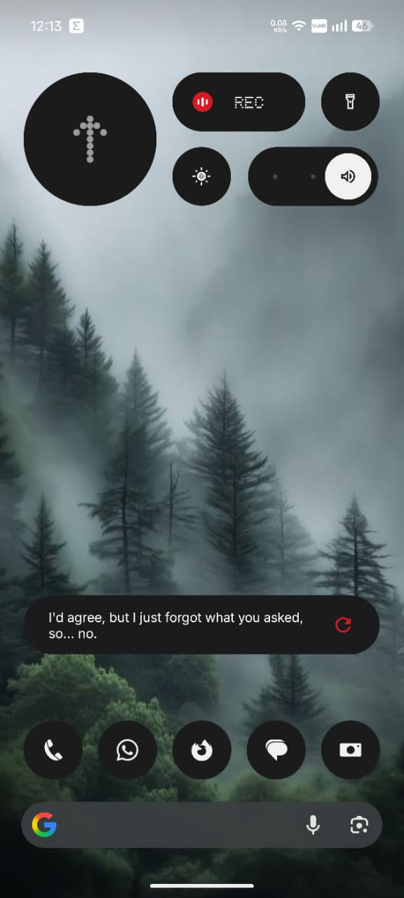
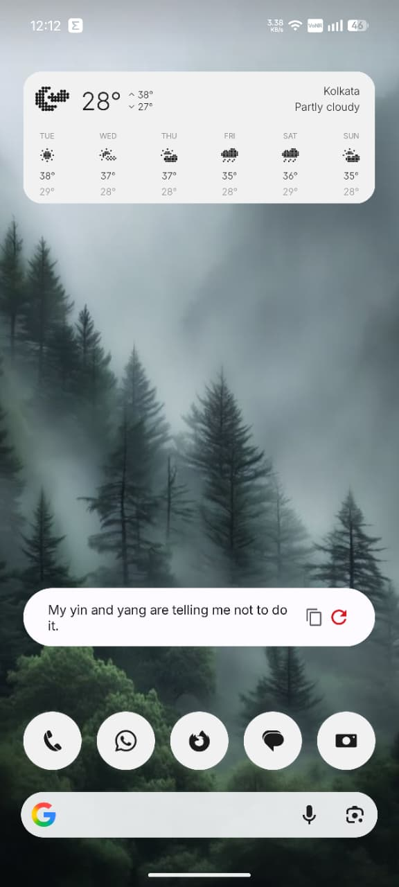
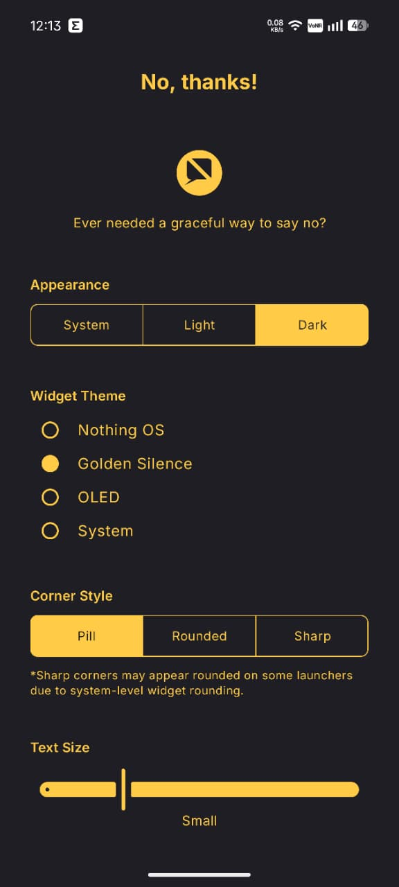
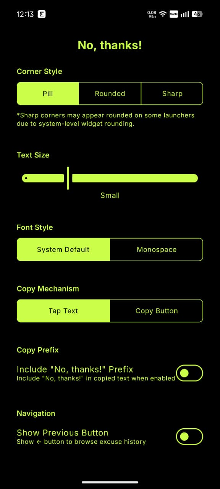

<div align="center">


# No, thanks!

*The excuse widget you never knew you needed.*

A minimal Android home screen widget that serves you random excuses to gracefully say "no" — powered by the [No as a Service](https://github.com/hotheadhacker/no-as-a-service) API.

<br>

[](https://github.com/codebydusk/no-thanks/releases/latest)
&nbsp;
[](https://github.com/codebydusk/no-thanks/releases)

**[⬇ Download latest APK](https://github.com/codebydusk/no-thanks/releases/latest)** &nbsp;·&nbsp; [View all releases →](https://github.com/codebydusk/no-thanks/releases)

> **Note:** The APK is unsigned (debug-signed by the CI runner). Android may show an "unknown source" prompt on first install.

</div>

## 📸 Screenshots

<p align="center">
  
  
  
  
</p>

---

## ✨ Features

### 📱 Widget Experience
- **Responsive Layouts**: Switch seamlessly between a compact **4×1** (up to 3 lines) or an expanded **4×2** (scrollable) layout.
- **Instant Excuses**: Tap the **refresh button (↻)** to fetch a fresh excuse instantly.
- **History Browsing**: Use the **previous button (←)** to step back through your last 10 excuses.
- **Smart Copying**: Tap to copy or use a dedicated button. Automatically prepend *"No, thanks!"* to your excuses.
- **Personality**: Enjoy sarcastic fallback messages when offline, and fun emoji-filled quips while loading or copying.

### ⚙️ Extensive Customization
- **Strict Duo-Tone Themes**: Choose from meticulously crafted themes that sync perfectly between the widget and the settings app.
- **Corner Styles**: From sleek **Sharp** edges to gentle **Rounded** borders and friendly **Pill** shapes.
- **Typography & Scale**: Pick between System Sans-serif or Monospace fonts, and precisely adjust text sizes using a 5-step slider.

---

## 🎨 Themes

| Theme | Vibe | Accent |
| :--- | :--- | :--- |
| 🎯 **Nothing OS** *(default)* | Dot-matrix monochrome tech aesthetic | 🔴 **Red** (`#d71921`) |
| ⚜️ **Golden Silence** | Erdtree-inspired elegance (Charcoal & Gold) | 🟤 **Rust** (`#CD4631`) |
| 🌑 **OLED** | Pitch black minimalism | 🟢 **Lime** (`#CAFE48`) |
| 🤖 **System** | Android 12+ dynamic wallpaper colors | 🎨 **Material You** |

> **Want to add your phone's theme?**
> I built this for Nothing OS, but it's meant for everyone. Fork the repo, add your colors to `Theme.kt` and `NoThanksWidget.kt`, and open a Pull Request! Everyone is welcome. 💛

---

## 🚀 Release History

### [v1.0.1](https://github.com/codebydusk/no-thanks/releases/tag/v1.0.1) — *The Polish Update* (June 2026)
- 📐 **New UI Controls**: Redesigned settings to use sleek, iOS-style bordered segmented controls.
- 🎨 **Strict Duo-Tone Setup**: Settings app now perfectly mirrors the active widget theme colors.
- 🌑 **OLED Theme Added**: Pitch-black background with high-contrast lime green accents.
- 📝 **Typography**: Added a 5-step Text Size slider (Extra Small to Extra Large).
- 😄 **Personality Injection**: Added fun emojis to loading states and copy confirmations.
- 🪲 **Bug Fixes**: Cleaned up the "No, thanks!" copy prefix logic and completely overhauled widget theming.

### [v1.0.0](https://github.com/codebydusk/no-thanks/releases/tag/v1.0) — *Initial Release* (May 2026)
- The very first release! Fetch excuses, copy them, and enjoy the basic Nothing OS / Golden Silence themes.

> *Older releases are available on the [GitHub Releases page](https://github.com/codebydusk/no-thanks/releases).*

---

## 🛠️ Building & Installation

**Prerequisites:** Android Studio, JDK 11+, Android device (API 26+)

1. Clone the repository and open in Android Studio.
2. Build the debug APK:
   ```bash
   ./gradlew assembleDebug
   ```
3. Install directly to your device:
   ```bash
   ./gradlew installDebug
   ```
4. **Adding the Widget**: Open the app once to initialize settings, then long-press your home screen, tap **Widgets**, and drag **No, thanks!** onto your grid.

---

## 🧑‍💻 Tech Stack
- **Kotlin 2.2**
- **UI Framework**: Jetpack Compose + Material 3
- **Widgets**: Jetpack Glance 1.1.1
- **Networking**: Retrofit 2.11 + Gson
- **Persistence**: DataStore Preferences

---

## ❤️ Credits & License

- Powered by **[No as a Service](https://github.com/hotheadhacker/no-as-a-service)** by [@hotheadhacker](https://github.com/hotheadhacker).
- Built with [Jetpack Glance](https://developer.android.com/jetpack/compose/glance).

This project is open source under the **[GNU General Public License v3.0](LICENSE)**.
