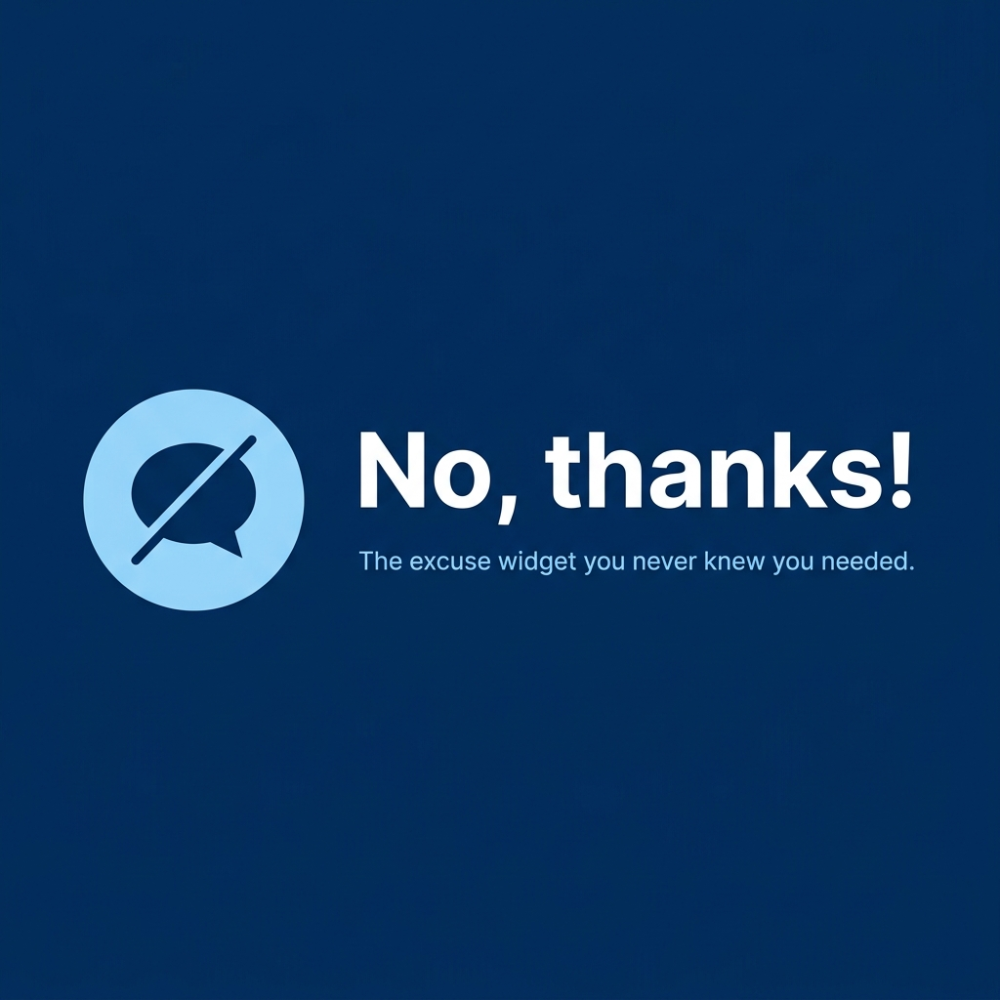

<div align="center">



# No, thanks!

*The excuse widget you never knew you needed.*

</div>

A minimal Android home screen widget that serves you random excuses to gracefully say "no" — powered by the [No as a Service](https://github.com/hotheadhacker/no-as-a-service) API.


## Download

<div align="center">

[](https://github.com/codebydusk/no-thanks/releases/latest)
&nbsp;
[](https://github.com/codebydusk/no-thanks/releases)

**[⬇ Download latest APK](https://github.com/codebydusk/no-thanks/releases/latest)** &nbsp;·&nbsp; [View all releases →](https://github.com/codebydusk/no-thanks/releases)

</div>

> **Note:** The APK is unsigned (debug-signed by the CI runner). Android may show an "unknown source" prompt on first install — this is expected. Enable *Install from unknown sources* for your browser or file manager.

### Release History

| Version | Date | Notes |
| --- | --- | --- |
| [v1.0.1](https://github.com/codebydusk/no-thanks/releases/tag/v1.0.1) | May 31, 2026 | Added text size adjustment (Small/Normal/Large) · Added emojis to loading and copy confirmation messages · Updated Copy Prefix description to clarify on/off behavior · "No, thanks!" prefix now respects Copy Prefix setting in widget display |
| [v1.0.0](https://github.com/codebydusk/no-thanks/releases/tag/v1.0) | May 30, 2026 | Initial release |

> Older releases are always available on the [GitHub Releases page](https://github.com/codebydusk/no-thanks/releases).


## Features

### Widget

- **Switchable 4×2 / 4×1 layout** — resizes automatically based on the space you give it
- **"No, thanks!" prefix** automatically prepended to every excuse
- **Scrollable text** in 4×2 mode for longer excuses; up to 3 lines in 4×1 mode
- **Refresh button** (↻) to fetch a new excuse from the API
- **Previous button** (←) to browse through your last 10 excuses (toggle-able in settings)
- **Tap to copy** or **dedicated copy button** — configurable in settings
- **Copy with or without prefix** — toggle whether "No, thanks!" is included in copied text
- **Hilarious copy confirmation with emojis** shown for 2 seconds after copying (randomly chosen from 10 messages)
- **Themed loading messages with emojis** — fun quips while the API is being called, no boring spinner
- **Sarcastic fallback messages** when the API is unreachable

### Settings App

- **Appearance** — System default / Light / Dark
- **Widget Theme** — 5 themes: Blueprint, Material, Nothing OS, Samsung One UI, OnePlus
- **Corner Style** — Pill / Rounded / Sharp
- **Text Size** — Small / Normal / Large
- **Copy Mechanism** — Tap text to copy, or show a dedicated copy button
- **Copy Prefix** — Toggle whether "No, thanks!" is included when copying
- **Navigation** — Toggle the previous (←) button on/off

## Widget Themes

| Theme | Style | Light Mode | Dark Mode |
| --- | --- | --- | --- |
| **Blueprint** *(default)* | Digital Blue palette | Light blue (`#E5F0FF`) bg · navy (`#002966`) text · blue (`#0052CC`) accent | Near-black (`#000E24`) bg · sky-blue (`#CCE0FF`) text · vivid blue (`#3385FF`) accent |
| **Material** | MD3 standard | Light surface (`#FFFBFE`) · dark text | Dark surface (`#1C1B1F`) · light text |
| **Nothing OS** | Dot-matrix monospace | Off-white (`#FAFAFA`) bg · grey (`#5C5C60`) text · **red** (`#D81921`) refresh icon | Light grey (`#1B1B1D`) bg · white (`#F5F3F7`) text · **red** refresh icon |
| **Samsung One UI** | Rounded sans-serif | Warm light (`#F7F7F7`) bg · dark text · bright blue (`#0066FF`) accent | Warm dark (`#1A1A1A`) bg · light text · light blue (`#4B9FFF`) accent |
| **OnePlus (OxygenOS)** | Clean minimal | Near-white (`#FAFAFA`) bg · dark text · **red** (`#F6000D`) refresh icon | Near-black (`#0F0F0F`) bg · light text · **red** refresh icon |

> Each theme automatically adapts to your device's system dark/light preference unless you override it in settings.

## Corner Styles

| Style | Corner Radius | Description |
| --- | --- | --- |
| **Pill** | 50 dp | Fully rounded, pill/capsule shape |
| **Rounded** | 8 dp | Gentle, Samsung-style corner rounding |
| **Sharp*** | 0 dp | True square with zero rounding |

> *Sharp corners may appear rounded on some launchers due to system-level widget rounding that cannot be overridden by the app.

## Text Size

| Size | Scale | Description |
| --- | --- | --- |
| **Small** | 85% | Compact text size for fitting more content |
| **Normal** *(default)* | 100% | Standard readable text size |
| **Large** | 125% | Enlarged text for better readability |

> Text size scales proportionally across all themes while maintaining visual consistency.

## Appearance Modes

| Mode | Behaviour |
| --- | --- |
| **System** | Follows the device's light/dark setting automatically |
| **Light** | Always uses the light variant of the selected theme |
| **Dark** | Always uses the dark variant of the selected theme |

## Copy Mechanism

| Option | Behaviour |
| --- | --- |
| **Tap text** | Tap anywhere on the excuse text to copy it to the clipboard |
| **Copy button** | Shows a dedicated copy icon (📋) next to the refresh button |

> By default, only the raw excuse text is copied. Use the **Copy Prefix** toggle in settings to include "No, thanks!" in the copied text.

## Copy Confirmations

After copying, one of these emoji-filled messages is shown at random for 2 seconds:

| | |
| --- | --- |
| That's a copy, Houston. 📋 | Snagged! Use it wisely. 🏯 |
| Ctrl+C executed. Godspeed. ⚡ | In your clipboard. No refunds. 📱 |
| Excuse extracted with prejudice. 🔪 | Pasted into your soul. 🌀 |
| That excuse is now legally yours. ⚖️ | Copy secured. Mission complete. ✅ |
| Yours now. Don't abuse it. 🤐 | Clipboard hijacked. You're welcome. 😎 |

## Theme-Specific Loading Messages

While fetching excuses, theme-appropriate loading messages with emojis appear:

### Nothing OS 🎯
- 📡 signal: searching...
- 🔊 beep. boop. thinking.
- // excuse.render() 💻
- ⏳ nothing to show yet...
- ✨ glyphs assembling...

### Samsung One UI 🌟
- 🤖 asking Bixby nicely...
- 🌌 Galaxy AI generating...
- 📡 SmartThings: working...
- 🎨 One UI loading excuse...
- ✨ Refreshed. Free RAM: 2.4KB!

### OnePlus (OxygenOS) ⚡
- 🚀 Never Settle... hold on!
- ⚡ Warp charging excuse...
- 🧠 OxygenOS AI processing...
- 🔔 Alert Slider: maybe?
- 🏆 Flagship loading...™

### Material Design 📚
- 📚 consulting MD3...
- 🌈 dynamic color: active
- 💧 ripple effect running
- 📄 applying elevation...
- 🎨 Material You: thinking...

## Screenshots

*Coming soon*

## Tech Stack

| Component | Technology |
| --- | --- |
| Language | Kotlin 2.2 |
| UI Framework | Jetpack Compose + Material 3 |
| Widget Framework | Jetpack Glance 1.1.1 |
| Networking | Retrofit 2.11 + Gson |
| Persistence | DataStore Preferences |
| Build System | Gradle (AGP 9.2.1) |
| Min SDK | 26 (Android 8.0) |
| Target SDK | 36 |

## Project Structure

```text
app/src/main/java/com/github/codebydusk/nothanks/
├── MainActivity.kt                  # Settings screen (Jetpack Compose)
├── data/
│   ├── ExcuseApi.kt                 # Retrofit API interface
│   └── ExcuseRepository.kt          # Data layer — API calls, history, settings, message banks
├── widget/
│   ├── NoThanksWidget.kt            # Glance widget UI & theming
│   ├── NoThanksWidgetReceiver.kt    # GlanceAppWidgetReceiver
│   └── WidgetActions.kt             # ActionCallbacks — refresh, history, copy
└── ui/theme/
    ├── Color.kt
    ├── Theme.kt
    └── Type.kt
```

## API

Uses [No as a Service](https://naas.isalman.dev/) — a free API that returns random excuses.

```text
GET https://naas.isalman.dev/no
```

Response:

```json
{
  "reason": "I signed up for a 'Just Say No' workshop and I'm committed to practicing."
}
```

## Building & Running

### Prerequisites

- Android Studio (latest stable)
- JDK 11+
- An Android device or emulator (API 26+)

### Build debug APK

```bash
./gradlew assembleDebug
```

Output: `app/build/outputs/apk/debug/app-debug.apk`

### Install directly on a connected device

```bash
./gradlew installDebug
```

### Adding the Widget

1. Open the **No, thanks!** app once to initialize settings
2. Long-press on your home screen → **Widgets**
3. Find **No, thanks!** and drag it to your home screen
4. Resize to **4×1** (compact, up to 3 lines) or **4×2** (expanded, scrollable)
5. Open the app to change theme, corner style, appearance, and copy behaviour

## Credits

- **[No as a Service](https://github.com/hotheadhacker/no-as-a-service)** by [@hotheadhacker](https://github.com/hotheadhacker) — for the brilliant idea and the API that powers this widget
- Built with [Jetpack Glance](https://developer.android.com/jetpack/compose/glance) and [Jetpack Compose](https://developer.android.com/jetpack/compose)

## License

This project is open source and available under the [MIT License](LICENSE).
